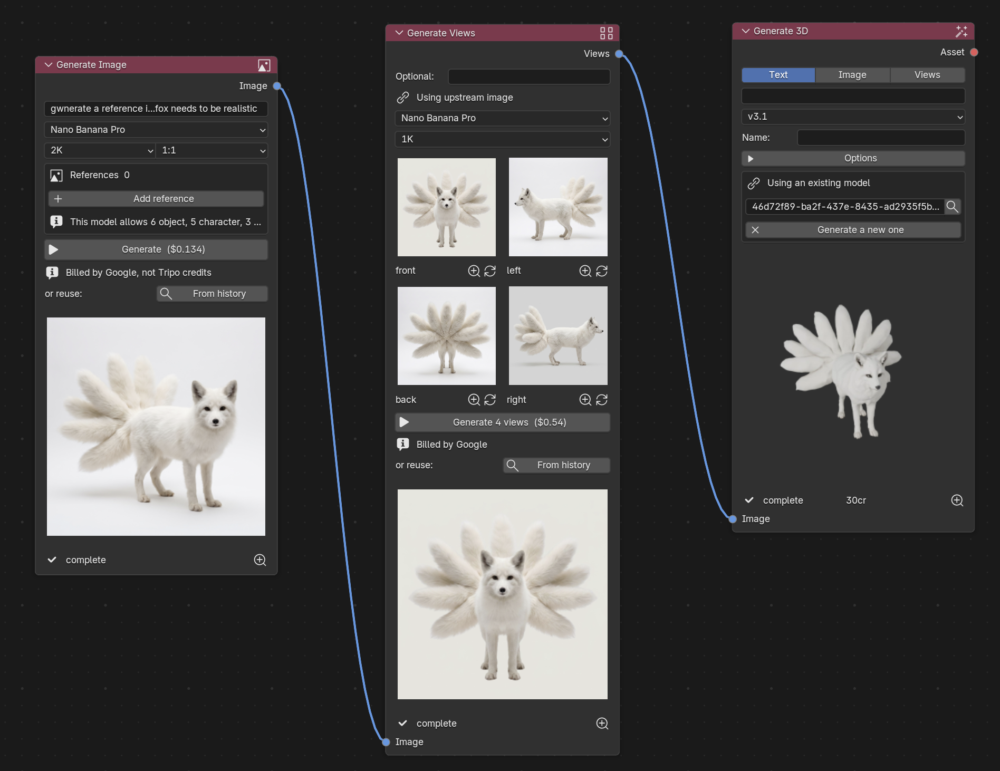
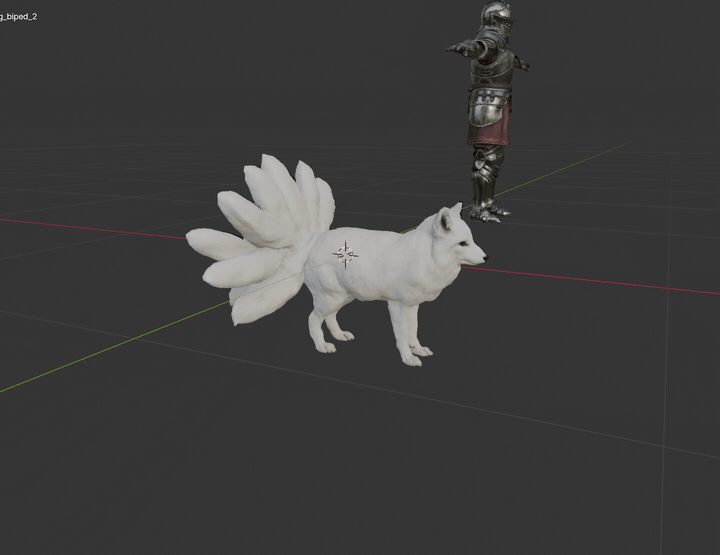

# Terracotta for Blender

[](https://github.com/ShamanAndrey/blender-terracotta/actions/workflows/tests.yml)
[](LICENSE)
[](https://github.com/ShamanAndrey/blender-terracotta/releases)

**Terracotta** is AI 3D asset generation as a node graph, inside Blender -- an army of assets, fired where you work. Generate meshes with
[Tripo](https://www.tripo3d.ai), concept images and reference views with
Google Gemini, then chain retopology, texturing, segmentation, rigging,
animation and export — all as nodes in a dedicated **Generate** workspace.

The addon is fully standalone: a factory Blender install and your own API
keys are all it needs.





## Install

1. Download `terracotta.zip` (or build it: `python3 tools/build_zip.py`).
2. Blender → Edit → Preferences → Add-ons → Install… → pick the zip → enable
   **Terracotta**. Blender 4.0 or newer.
3. Open the **Generate** workspace from the top bar (new files get it
   automatically, along with a starter example graph).
4. Click the key icon in the node editor header (or use the **Account** node)
   and enter your keys:
   - **Tripo** — 3D generation, billed in Tripo credits.
     Get a key at [platform.tripo3d.ai](https://platform.tripo3d.ai).
   - **Google** — image generation, billed by Google on your own account.
     Get a key at [aistudio.google.com/app/apikey](https://aistudio.google.com/app/apikey)
     (image models need billing enabled — the Free tier returns quota errors).

Keys are stored in Blender's preferences on your machine. They are never
written into .blend files, so sharing a file never shares a key.

## The nodes

| Node | What it does |
| --- | --- |
| **Generate Image** | Text (+ reference images) → concept image, via Gemini |
| **Generate Views** | One subject → consistent front/left/back/right views |
| **Generate 3D** | Text, image, or four views → textured mesh (Tripo) |
| **Import Asset** | Upload your own mesh so the chain can process it (free) |
| **Process** | Retopology, texturing, segmentation, stylize |
| **Rig** | Free rigability check, then skeleton build |
| **Animate** | Preset animations retargeted onto a rig |
| **Export** | Convert and save to disk (glTF/FBX/OBJ/USDZ/STL/3MF) |
| **Import** | Bring the finished asset into the scene; placement, decimation and asset-library marking live here |
| **Account** | Key status and credit balance |

**Run Graph** (header) runs a whole chain in dependency order. Nodes that
already have a result are skipped — re-running finished work would charge for
it again; a node's own button always forces a re-run. Every button shows its
cost before you click it.

The **Jobs** panel (sidebar) shows live progress; the **Library** panel lists
past generations with thumbnails — anything you already paid for re-imports
for free. Example graphs for the common workflows are in the **Examples**
header menu.

## Costs

Prices are quoted on every button and centralized in
[costs.py](terracotta/costs.py). Ballpark: a textured v3.1 generation is
20–30 Tripo credits; rigging 25; a Gemini image $0.03–0.24 depending on model
and size. The full API reference, with every task type and price we've
measured, is in [TRIPO_API.md](TRIPO_API.md).

## Development

```bash
# Run the offline test suite (no credits, no network):
/path/to/Blender -b --python tests/test_tripo.py

# Package the addon:
python3 tools/build_zip.py
```

The suite mocks the network layer and runs the real import pipeline —
generation, chaining, rigging, history, money-guards — 400+ checks.
`CLAUDE.md` documents the project conventions; `ROADMAP.md` is where this is
going.

`.mcp.json` is development tooling only (for the
[blender-mcp](https://github.com/ahujasid/blender-mcp) bridge that lets an AI
assistant drive a live Blender session; install its addon from upstream if
you want that workflow). End users don't need it.

## License

GPL-3.0-or-later — see [LICENSE](LICENSE). Blender add-ons are derivative
works of GPL Blender, and this is also the license the official
[Extensions platform](https://extensions.blender.org) requires.
